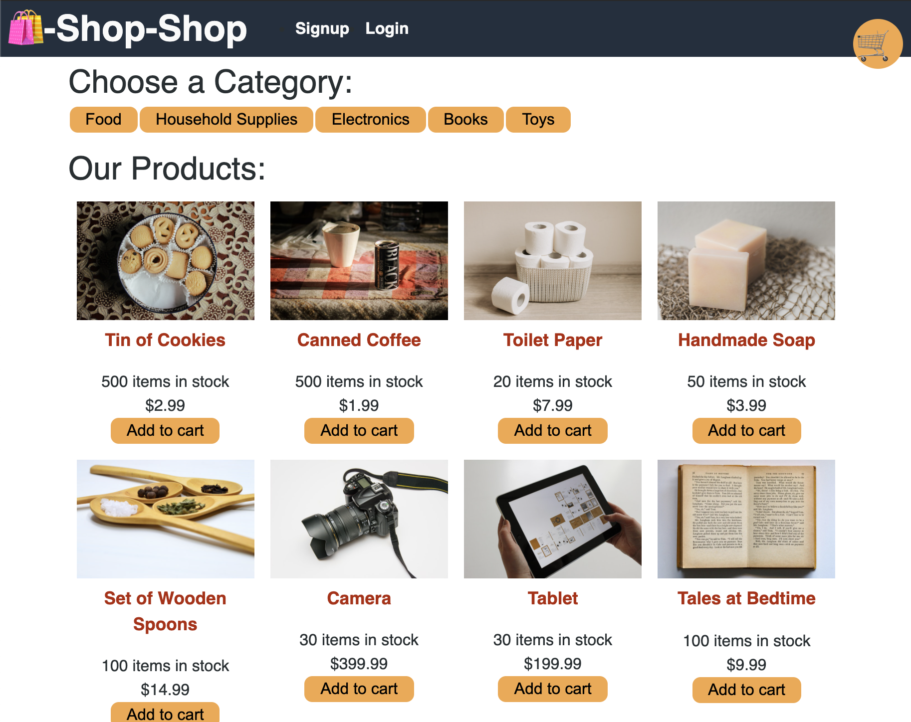

# Redux-Store

## Description

An E-Commerce full stack application built with React, GraphQL, and a MongoDB Database. This app has been refactored to use Redux to manage a global state to prevent prop drilling. The app also includes the stripe api for test functionality and checkout.

## Table of Contents

* [Installation](#installation)
* [Usage](#usage)
* [Reference](#reference)

## Installation

* copy source code
* run npm install
* npm run seed
* run npm start

## Usage 

* The App can be found [Here](https://redux-store4123.herokuapp.com/)
* Create an account by providing a username, email, and password
* Add items to your cart.
* Checkout the items from your cart.
* See previous orders.

    
## Reference

[Link to Deployed Site](https://redux-store4123.herokuapp.com/)

